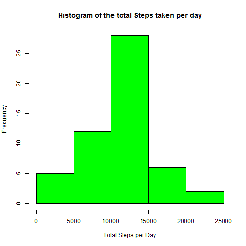
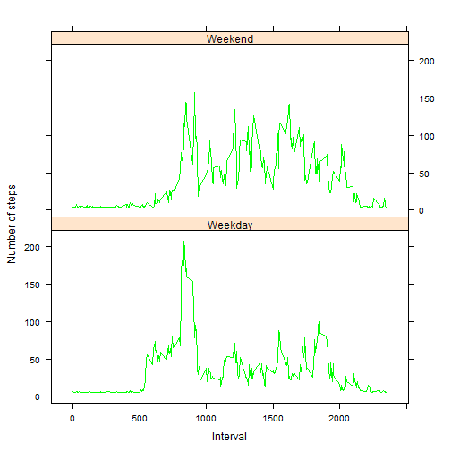

output:
  md_document:
    variant: markdown_github
---

#**Reproducible Research: Peer Assessment 1**

###**Loading and preprocessing the data**


```r
data.file <- "activity.csv"

if (!file.exists(data.file)){
    download.file("http://d396qusza40orc.cloudfront.net/repdata%2Fdata%2Factivity.zip", destfile = "data.zip", method="curl")
    
  unzip("data.zip")
  file.remove("data.zip")
}


activity <- read.csv(data.file, header= T,sep=",")

activSteps <- activity$steps 
activInterval <- activity$interval  
activDate  <- activity$date <- as.Date(activity$date,"%Y-%m-%d")
```

Print a summary of the data set


```r
summary(activity)
```

```
##      steps             date               interval     
##  Min.   :  0.00   Min.   :2012-10-01   Min.   :   0.0  
##  1st Qu.:  0.00   1st Qu.:2012-10-16   1st Qu.: 588.8  
##  Median :  0.00   Median :2012-10-31   Median :1177.5  
##  Mean   : 37.38   Mean   :2012-10-31   Mean   :1177.5  
##  3rd Qu.: 12.00   3rd Qu.:2012-11-15   3rd Qu.:1766.2  
##  Max.   :806.00   Max.   :2012-11-30   Max.   :2355.0  
##  NA's   :2304
```

###**The mean total number of steps taken per day**

Calculate the total number of steps taken per day


```r
sumNumStepDay <- tapply(activSteps, activDate, sum)
```

Plot the histogram of the total steps per day


```r
hist(sumNumStepDay, col = "green", xlab = "Total Steps per Day", ylab = "Frequency", 
                     main = "Histogram of the total Steps taken per day")
```




Comput the mean of total steps taken per day


```r
meanNumStepsDay <- mean(sumNumStepDay,na.rm = TRUE)
meanNumStepsDay
```

```
## [1] 10766.19
```

Comput the median of total steps taken per day


```r
medNumStepsDay  <- median(sumNumStepDay, na.rm = TRUE)
medNumStepsDay
```

```
## [1] 10765
```

###**The average daily activity pattern**

Calculate average of steps in each 5 minutes interval.


```r
averNumStepDay <- tapply(activSteps, activInterval, mean, na.rm = TRUE)
```

Timeseries plot of of the 5-minute interval and the average number of steps taken, averaged across all days


```r
plot(row.names(averNumStepDay), averNumStepDay, type = "l", xlab = "Time Intervals (5-minute)", 
     ylab = "Mean number of steps taken all days", main = "Timeseries of steps taken at 5 minute Intervals", 
     col = "green")
```


The 5-minute interval on average across all the days in the dataset containing the maximum number of steps


```r
maxNumStepInt <- which(averNumStepDay == max(averNumStepDay))
maxAverNumSteps <- max(averNumStepDay)
maxAverNumSteps
```

```
## [1] 206.1698
```

Find the time interval that contains the maximum average number of steps over all days


```r
maxNumStepInt <- which.max(averNumStepDay)
maxAverNumSteps <- names(maxNumStepInt)
maxNumStepInt
```

```
## 835 
## 104
```

The 104 5-minute interval contains the 
maximum number of steps on average across all the days

###**Imputing missing values**

Calculate and report the total number of missing values in the dataset


```r
idxNaRow  <- is.na(activSteps)
numNaRow <- sum(idxNaRow)
numNaRow
```

```
## [1] 2304
```

```r
activity$steps[idxNaRow] <- round(mean(activSteps[!idxNaRow]))
```

Fill in missing values using the average interval value across all days


```r
naIdx <- which(is.na(activity))
imputNaVal <- averNumStepDay[as.character(activity[naIdx, 3])]
names(imputNaVal) <- naIdx
for (i in naIdx) {
        activity$steps[i] = imputNaVal[as.character(i)]
}
```

Checking that there is no longer NA values in the data


```r
sum(is.na(activity))
```

```
## [1] 0
```

###**Differences in activity patterns between weekdays and weekends**

Creat a new factor variable in the dataset with two levels - "weekday" and "weekend" indicating whether a given date is a weekday or weekend day.


```r
weekDays <- weekdays(activDate)

activity$dayType <- ifelse(weekDays == "samedi" | weekDays == "dimanche", "Weekend", 
                           "Weekday")
```

Make a panel plot containing a time series plot 


```r
averNumStepDay <- aggregate(activity$steps, by = list(activity$interval, activity$dayType), 
                       mean)

names(averNumStepDay) <- c("interval", "dayType", "steps")

library(lattice)
xyplot(steps ~ interval | dayType, averNumStepDay, type = "l", layout = c(1, 2), 
       xlab = "Interval", ylab = "Number of steps", col = "green")
```


